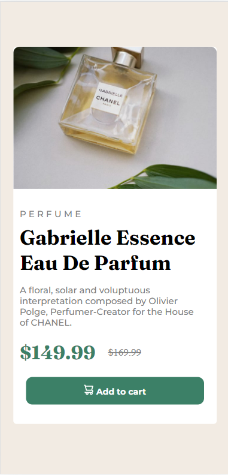
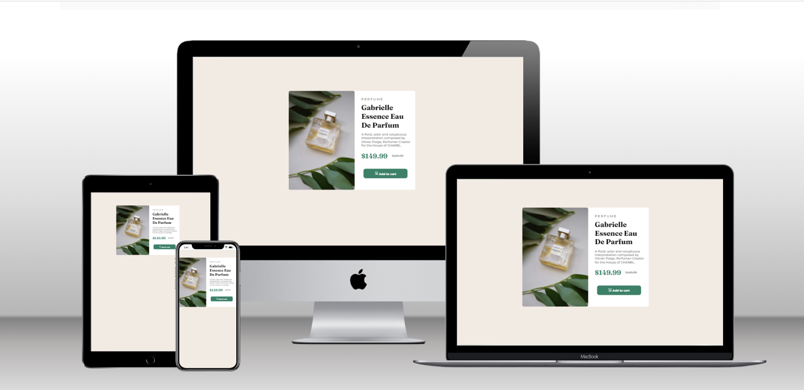

# Frontend Mentor - Product preview card component solution

This is a solution to the [Product preview card component challenge on Frontend Mentor](https://www.frontendmentor.io/challenges/product-preview-card-component-GO7UmttRfa). Frontend Mentor challenges help you improve your coding skills by building realistic projects. 

## Overview
Created Responsive Product Review card component with using HTML5 semantics & CSS Flexbox model.

### The challenge

Users should be able to:

- View the optimal layout depending on their device's screen size
- See hover and focus states for interactive elements

### Screenshot




### Links

- Solution URL: [Solution URL is here](https://github.com/Fatima-hub333/Product-Review-Card)
- Live Site URL: [Live site URL is here](https://lucky-cheesecake-38b975.netlify.app)

## My process
I create html template first after that I started stylin components one by one.
### Built with

- Semantic HTML5 markup
- CSS custom properties
- Flexbox
- Mobile-first workflow

### What I learned

I learned media queries via solving this challenge as it has different layout for mobile screen & desktop screen. So yeah it's amazing I learned new things how to use media queries using different screen widths. I really liked this pattern and will use it going forward.

## Getting Started
To get a local copy up and running, follow the steps in Setup below.

### Prerequisites
Basic knowledge of HTML, CSS.

### Setup
If you installed git you can clone the code to your machine, or download a ZIP of all the files directly.

[Download the ZIP from this location](https://github.com/Fatima-hub333/Google_clone/archive/refs/heads/main.zip), or run the following [git](https://git-scm.com/downloads) command to clone the files to your machine:

```bash
git clone https://github.com/Fatima-hub333/Google_clone.git
```

- Once the files are on your machine, open the _Portfolio_ folder in [Visual Studio Code](https://code.visualstudio.com/).

- With the files open in Visual Studio Code, press the **Go Live** button at the bottom of the window to launch the files with [Live Server](https://marketplace.visualstudio.com/items?itemName=ritwickdey.LiveServer).

### Install

The following tools help make easier to work with sample code.

- [git](https://git-scm.com/downloads): A tool for managing source code
- [Visual Studio Code](https://code.visualstudio.com/): A source code editor
- [Live Server](https://marketplace.visualstudio.com/items?itemName=ritwickdey.LiveServer): A simple web server utility for Visual Studio Code

## Authors

👤 **Fatima Zahir**

- GitHub: [@githubhandle](https://github.com/Fatima-hub333)
- Twitter: [@twitterhandle](https://twitter.com/Fatima_developr)
- LinkedIn: [LinkedIn](https://www.linkedin.com/in/fatimaa-zahir/)

## 🤝 Contributing

Contributions, issues, and feature requests are welcome!

Feel free to check the [issues page](https://github.com/Fatima-hub333/Google_clone/issues).

## Show your support

Give a ⭐️ if you like this project!


## 📝 License

This project is [MIT](./MIT.md) licensed.